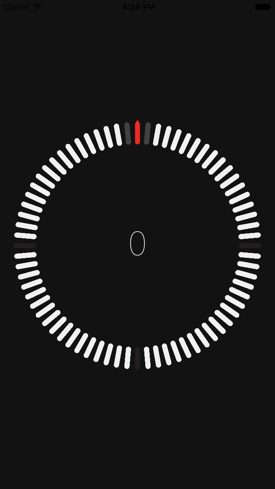

# DIRECTION
### COMPASS APP
iOS App created by VARUN BALLARI.

### What is DIRECTION?
- Direction is a compass app.
- It vibrates the iPhone when the internal compass is pointed North.
- It utilizes CLLocationManagerDelegate & AudioServicesPlayAlertSound.

### Running the App
- Just click the app on the home screen and TURN.

### Try out these features!
- Point North!

### Things you should be aware of
- The app will continously vibrate when pointed North.
- Please be aware that this might damage the the vibrating mechanism and/or the phone.
