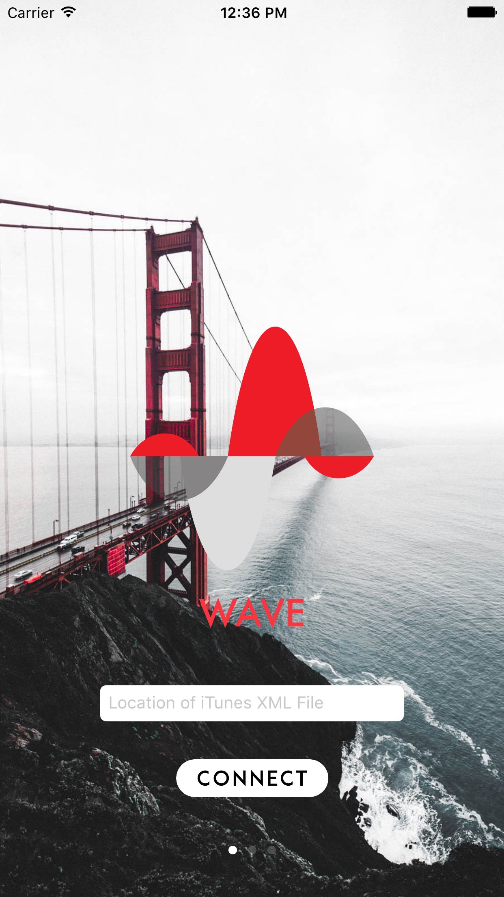
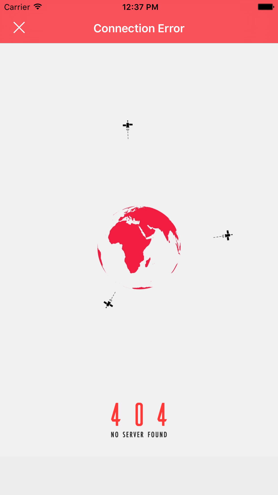
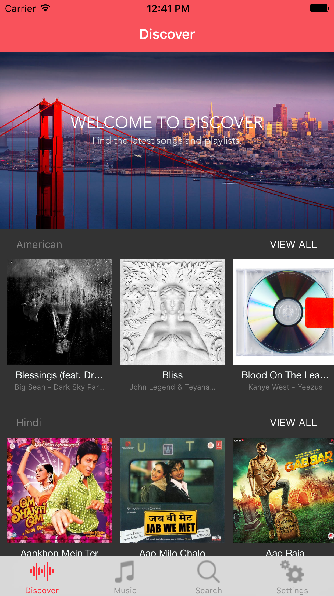
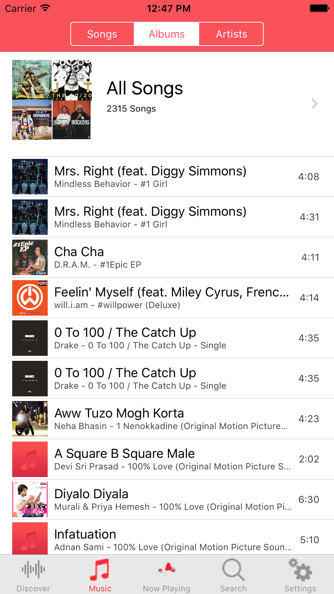
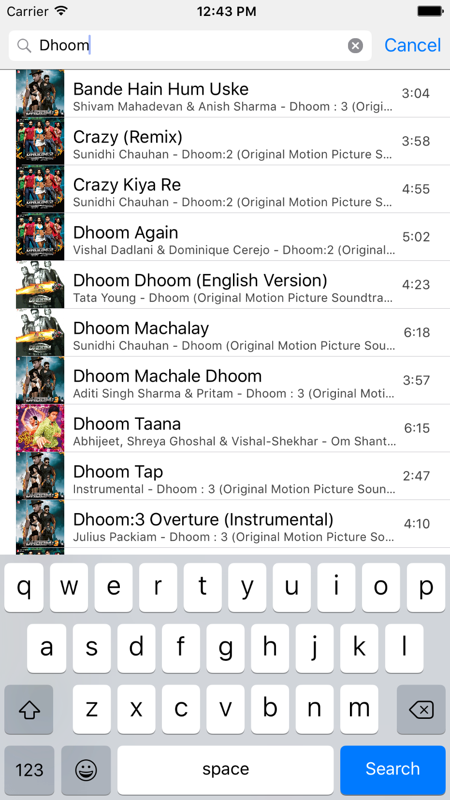
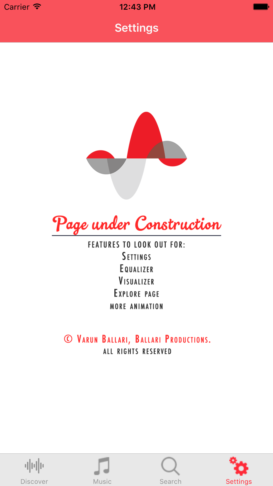

# WAVE
### AUDIO STREAMING & UI
iOS App created by VARUN BALLARI.

### What is WAVE?
- WAVE is an audio streaming service that allows you to stream your own music.
- Other streaming services, like Spotify and Apple Music, are costly and only stream certain genres of music.
- WAVE gives you the ability to listen to your music, whatever genre or audio file it is, wherever and whenever.
- You can listen to any audio file that is on iTunes through WAVE.
- It is fully integrated with iTunes.

### What do I need to stream my own Music?
- WAVE App
- A home server that hosts your audio files and 'iTunes Music Library.xml' file
- Internet Connection

### Running the App
To run it the app on your iPhone, make sure you have a streaming server setup and have your audio files and 'iTunes Music Library.xml' file on the server. Connect using the correct location of the 'iTunes Music Library.xml' file.

To run it the app on your Mac, make sure you have the XCode Simulator app and have your audio files and 'iTunes Music Library.xml' file on the disk. Connect using the correct location of the 'iTunes Music Library.xml' file.

### Try out these features!
- Enter incorrect file location
- Enter correct file location + " "
- Search for songs
- Shuffle songs
- Sort Music by Song, Album & Artist
- Play songs

### Things you should be aware of
- The app currently uses a lot of memory due to pictures. It might run slowly.
- Setting Page and other features, like view Album & view Playlist, are still under construction.
- WAVE might not work if you have Podcasts or Movies in iTunes. Remove both before running the app.
